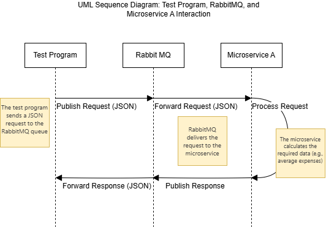

### Requesting Data from Microservice A
To request data from Microservice A, send a JSON message to the RabbitMQ queue `budget_requests`. The message should include:
- `type`: The type of calculation (e.g., `"average_expenses"`).
- `data`: A JSON object with `period_start` and `period_end` dates.

**Example Request:**
```json
{
    "type": "average_expenses",
    "data": {
        "period_start": "2025-01-01",
        "period_end": "2025-01-31"
    }
}
```

### Receiving Data from Microservice A
Microservice A will send a JSON response to the RabbitMQ queue `budget_responses`. The response will include:
- `status`: The status of the request (e.g., `"success"` or `"error"`).
- `data`: The calculated data (e.g., average expenses).

**Example Response:**
```json
{
    "status": "success",
    "data": {
        "average_expenses": 1200.50,
        "period_start": "2025-01-01",
        "period_end": "2025-01-31"
    }
}
```

### UML Sequence Diagram
